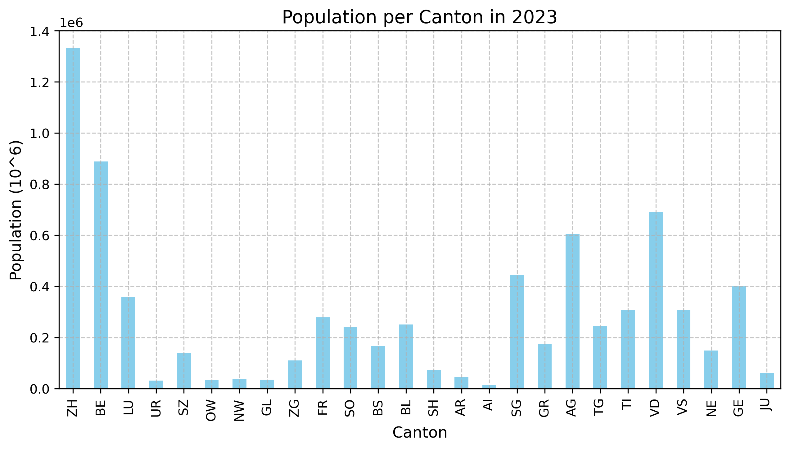
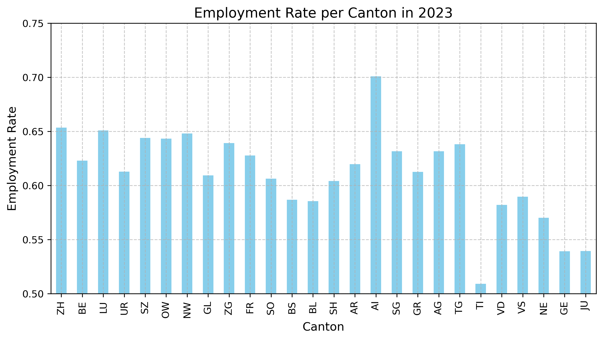

# Milestone 1

### Dataset

Our dataset consists of four key components:

1. [**GDP**](https://opendata.swiss/en/dataset/bruttoinlandsprodukt-bip-nach-grossregion-und-kanton5): Records the GDP variations of each canton from 2008 to 2022, providing insights into economic trends.
2. [**Population**](https://www.bfs.admin.ch/news/en/2024-0234): Includes total population, age structure, and gender distribution of each canton from 2019 to 2023, which are crucial for understanding social development and quality of life.
3. [**Employment**](https://www.bfs.admin.ch/bfs/en/home/statistics/work-income/employment-working-hours/economically-active-population/economically-active-persons-canton.html): Documents the employment status in each canton for 2023, including employed persons, unemployed persons, individuals looking after home or family, and retired persons, reflecting the labor market conditions.
4. [**Portraits-of-the-cantons**](https://www.bfs.admin.ch/bfs/en/home/statistics/regional-statistics/regional-portraits-key-figures/cantons.html): Covers income, economy, agriculture, and tourism statistics from 2019 to 2021, offering a more comprehensive socio-economic background.

#### Data Quality and Preprocessing

- This dataset comes from an official source and includes all Swiss cantons, so we can trust its accuracy.
- Since the datasets cover different periods, we need to align the timelines to make meaningful comparisons.
- We'll convert Excel files into a more manageable format and extract key details for visualization.
- To avoid confusion from different languages, we will map canton names to their standard abbreviations (e.g., Zürich → ZH, Genève → GE).

### Problematic

#### Motivation

Many reports suggest that Switzerland is one of the happiest countries in the world. As international students, we are fascinated by this beautiful country and want to understand what makes it so unique. During our time in Switzerland, we have admired the tranquility of Lake Geneva, experienced the vibrancy of Zurich, and embraced the Italian influence in Ticino. Over time, we realized that the differences between cantons go beyond just the official languages. This led us to a question: How much does happiness vary among the residents of different cantons?

Thus, we created the project **"Happiness Index Across Swiss Cantons"** to explore which cantons may have higher levels of happiness and let data guide our curiosity in uncovering meaningful insights.

#### Visualization Goals

Happiness is complex and cannot be defined by a single number. A high GDP does not guarantee happiness, and low unemployment does not always mean satisfaction. To build a clearer picture, we analyze multiple factors.

Through our visualization, we will:

- **Use an interactive map of Switzerland**, allowing users to hover over cantons and explore key indicators such as economy, population, and employment.
- **Enable direct comparisons** between two cantons, offering a multi-angle perspective on "Which canton is happier?"
- **Display trends over time**, analyzing how social and economic conditions have evolved across different cantons.
- **Present key insights through visualized data**, highlighting potential happiness indicators such as GDP per capita, employment rate, and demographic composition.

Finally, we want this visualization to go beyond raw statistics—we want users to define happiness in their own way through an interactive and insightful experience.

#### Target Audience

- **Residents and Future Settlers**: Understand the quality of life across different cantons and plan for the future.
- **Curious Minds**: Serves as a storytelling tool that reveals Switzerland’s diversity and unique characteristics.
- **Policy Makers and Administrators**: Analyze economic and social conditions to improve well-being.

### Exploratory Data Analysis

In this part, we illustrate our current dataset.

#### GDP

GDP measures the activeness of the economy. The higher GDP is, the wealthier people tend to be. We have the GDP of each canton from 2008-2022. Here's a graph of the GDP trend of each canton.

We can see that from 2008 to 2022, Zürich(ZH) and Bern(BE) have the largest GDP. The GDP of Zürich has a clear lead, which is almost twice and Bern. Generally, the GDP of Zürich and Bern has a steady growth from 2008 to 2022, while the trend of other cantons is quite stable, without a noticeable increase.

#### Population

Population can serve as an indicator of a society’s vibrancy. Here, we present the population of each canton in 2023.

From the figure, the top 5 cantons with the most population is Zürich(ZH), Bern(BE), Vaud(VD), Aargau(AG) and St. Gallen(SG). Again, Zürich has a clear lead, with around 1.3 million people, while the second place, Bern, has around 0.8 million.

#### Employment Rate

Employment rate could reflect the society atmosphere and the potential safety risk, which is an important indicator for happiness.

For employment rate, Appenzell I. Rh.(AI) ranks first, with employment rate around 70%. Zürich(ZH) and Luzern(LU) come next, both of them around 65%. Ticcino(TI) comes last for employment rate, only barely over 50%.

#### Conclusion

Switzerland is a federal state made up of individual cantons, each with its own unique characteristics. Here, we present a preliminary analysis of a portion of our dataset on happiness. As our project progresses, we will incorporate additional data sources to provide a more comprehensive representation of the happiness index across cantons.

### Related work

We drew inspiration from the two main sources:

1. [**Swiss Federal Statistical Office (BFS) Regional Statistics**](https://www.bfs.admin.ch/bfs/en/home/statistics/regional-statistics/regional-portraits-key-figures/cantons.html): Provides key figures on Swiss cantons but focuses on raw data rather than exploring happiness-related factors.

2. [**Statiswiss Project**](https://com-480-data-visualization.github.io/com-480-project-statiswiss/): An interactive visualization of Swiss statistics, but it presents general socio-economic data rather than analyzing happiness.

Originality of Our Approach:

1. **Happiness Focus**: We explore the relationship between economic, demographic, and employment factors and happiness rather than just displaying statistics.
2. **Direct Canton Comparison**: Users can compare different cantons across multiple indicators to assess disparities in happiness.
3. **Time Trend Analysis**: We visualize changes over time to track how economic and social conditions evolve.

This dataset has not been used in any other course or project before.

