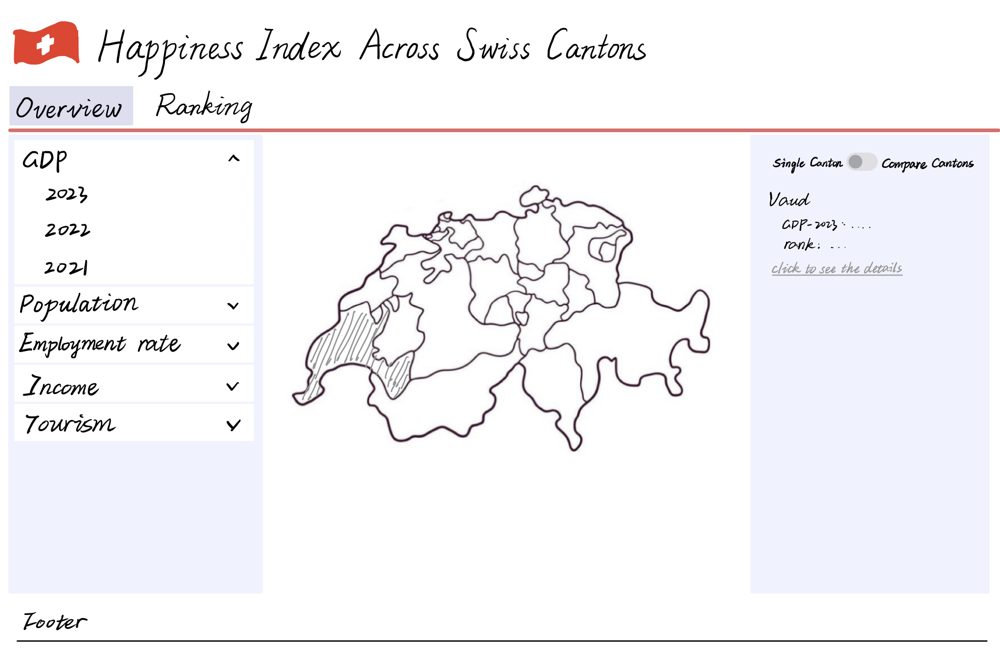
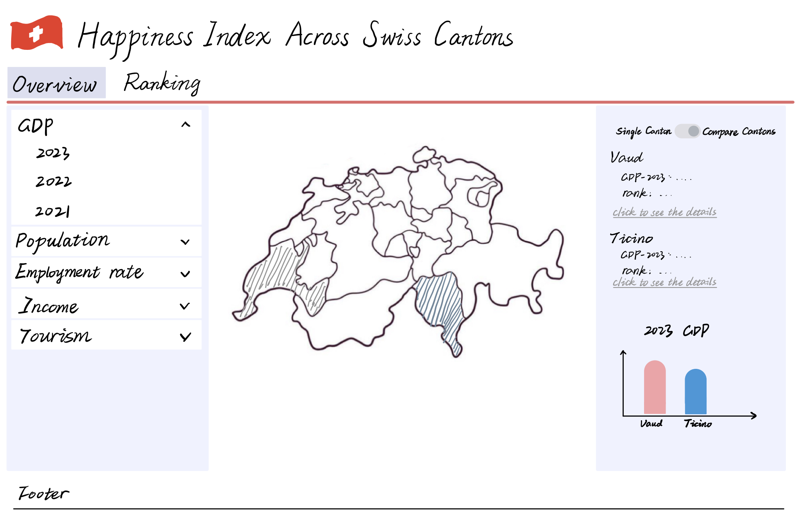
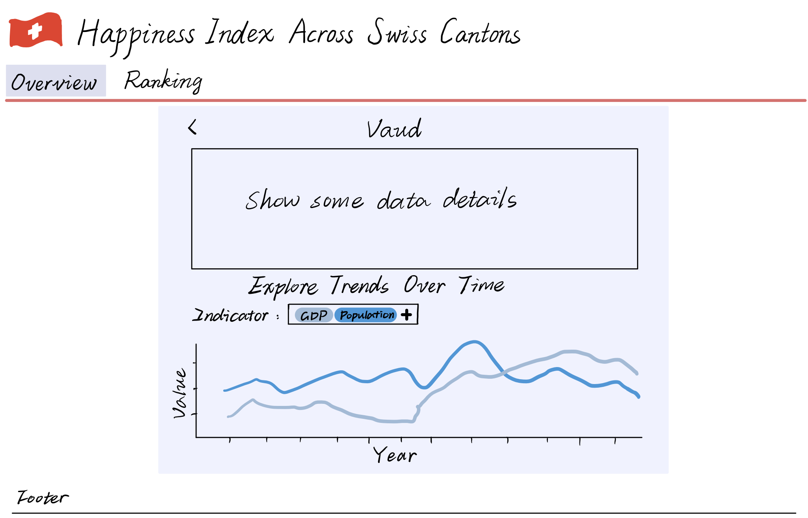
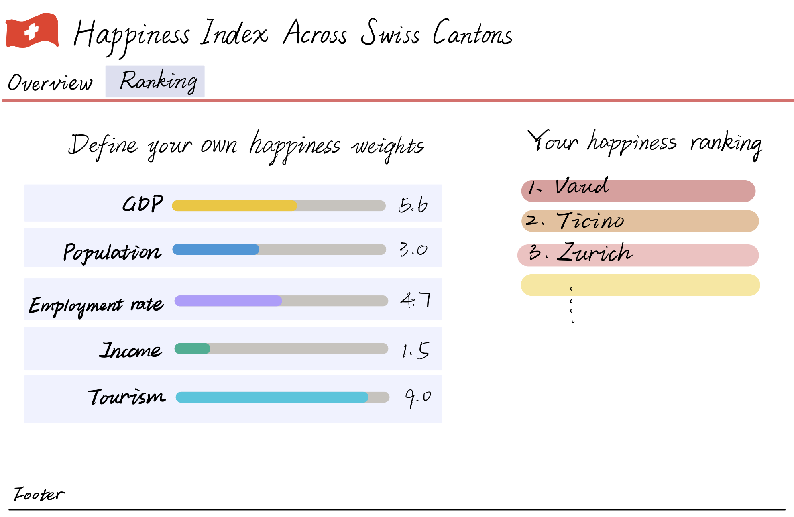

## Milestone 2

### Project Goal

The goal of our project, **“Happiness Index Across Swiss Cantons,”** is to explore regional variations in quality of life across Switzerland through a multi-dimensional, data-driven lens. Our aim is not to define happiness with a single metric, but rather to let users interactively explore relevant socio-economic factors and derive their own insights.

#### Sketches of visualisation

##### 1. Visualize Socio-Economic Indicators Across Cantons

We will provide an **interactive choropleth map** of Switzerland where users can:

- **Hover over cantons** to view summaries of GDP per capita, population, and employment rate, etc.

- **Use color gradients** to quickly grasp which cantons rank higher or lower on a selected indicator.

  

##### 2. Enable Canton Comparison

Users can:

- Select any two cantons for **side-by-side comparison**.
- **View charts** (e.g., bar charts or radar plots) showing differences in happiness-related indicators.

##### 3. Explore Trends Over Time

We will visualize how indicators such as GDP and population have **changed over time** for individual cantons, allowing users to:

- Select a canton and view line charts or area plots.
- Compare historical trends between cantons.

##### 4. Happiness Oriented Display

Since happiness is subjective, we aim to:

- Let users **define their own happiness index** by assigning weights to indicators. Display a dynamic “happiness ranking” of cantons based on user preferences.
- Each indicator is represented by a horizontal percentage bar (slider), visually indicating the current weight assigned to that factor. Users can drag the slider left or right to adjust how important that particular indicator is in their personal happiness definition.

#### Tools for the Visualizations

So far, we have used the following tools for building the visualizations:

1. **Vue.js** – For building interactive, component-based web interfaces.
2. **Element Plus** – Provides ready-to-use UI components for consistent and responsive layouts.
3. **AntV (G2, G6)** – Used to create high-quality interactive charts and comparison visualizations.
4. **D3.js** – Powers our customizable geographic maps with fine-grained SVG control.

Very helpful related lectures:

- **Lecture: Practical maps** & **Lecture: Maps** – how to build choropleth maps and map interactivity  
- **Lecture: Perception colors** – how to choose perceptually effective gradients  
- **Lecture: Interactions** – influenced map hover/click behavior design
- **Lecture: Mark, channels** – how we encoded values visually in bar/radar charts  

#### Goals Breakdown

**Core Idea: interactive map of Switzerland**

- Illustrating key indicators such as economy, population, and employment.
- Allowing users to hover over cantons to check the specific statistic of the canton
- Using colors to indicate the value of each canton

**Optional Enhancements:**

1. Enable direct comparisons between two cantons, offering a multi-angle perspective on "Which canton is happier?"
2. Display trends over time, analyzing how social and economic conditions have evolved across different cantons.
3. Enable user defined happiness index, by assigning weights to key happiness indicators such as GDP per capita, employment rate.  **Interactive sliders allow users to intuitively adjust preferences, with instant visual feedback and live-updated rankings**, making the experience both exploratory and engaging.

### Functional Prototype

https://com-480-data-visualization.github.io/com-480-project-Ficciones/
